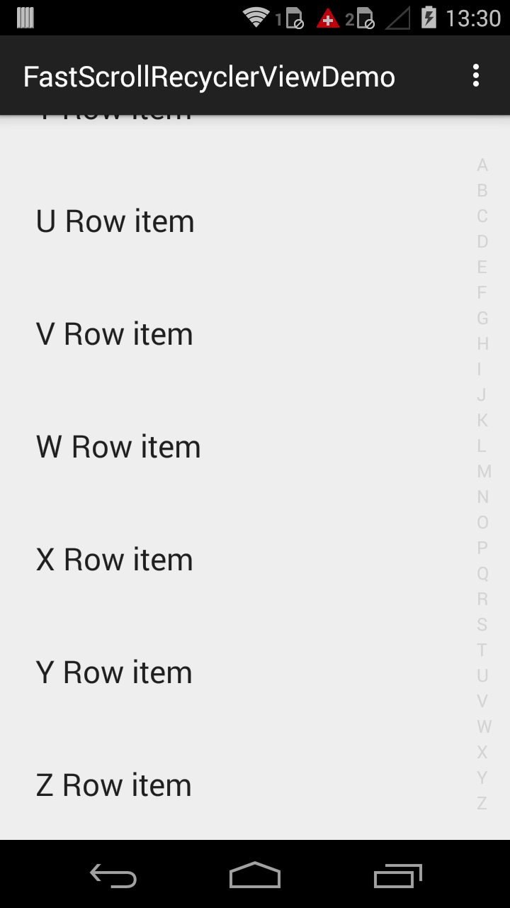
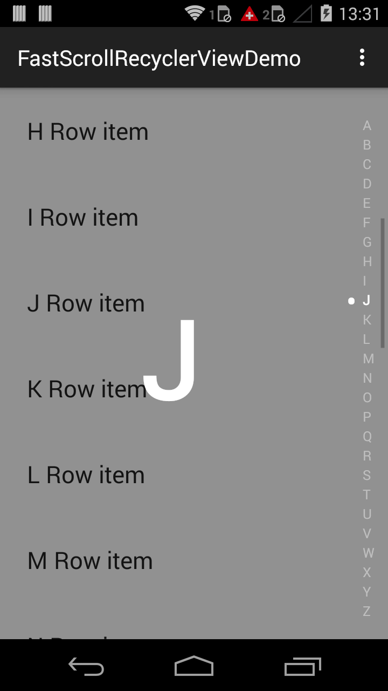
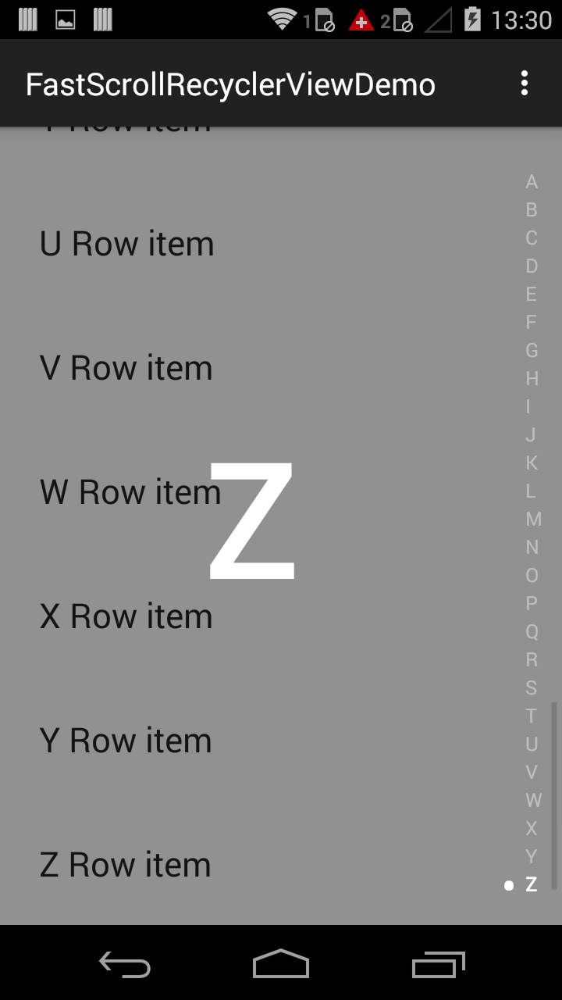

# Description
This is an example that shows how add an iOS like A-Z Fast Scroll on the new RecyclerView released with Android L. Ready to compile in Android Studio. <br /> <br />



# How to use
 - I am assuming that you already got an implementation of RecyclerView working. If not you can follow the example here: https://developer.android.com/training/material/lists-cards.html
 - Replace `android.support.v7.widget.RecyclerView` with `com.codecomputerlove.fastscrollrecyclerviewdemo.FastScrollRecyclerView`
 - Your adapter needs to implement `FastScrollRecyclerViewInterface` and override `getMapIndex()`. The function should return the mapIndex. Look into `calculateIndexesForName()` for inspiration on how to create it. Once created pass it to the adapter in the constructor.
 - Create an instance of `FastScrollRecyclerViewItemDecoration` and add it on your `RecyclerView`
 ```
     FastScrollRecyclerViewItemDecoration decoration = new FastScrollRecyclerViewItemDecoration(this);
        mRecyclerView.addItemDecoration(decoration);
 ```
 - add `    <dimen name="fast_scroll_overlay_text_size">100dp</dimen>` to your /values/dimens.xml file. This is the dp size of the overlayed letter
